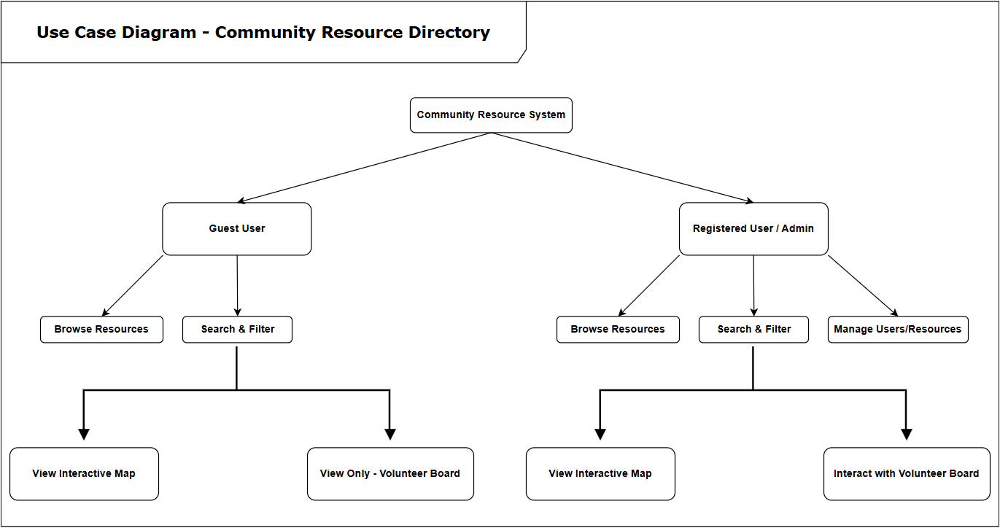

<!-- Improved compatibility of back to top link: See: https://github.com/othneildrew/Best-README-Template/pull/73 -->
<a id="readme-top"></a>
<!--
*** Thanks for checking out the Best-README-Template. If you have a suggestion
*** that would make this better, please fork the repo and create a pull request
*** or simply open an issue with the tag "enhancement".
*** Don't forget to give the project a star!
*** Thanks again! Now go create something AMAZING! :D
-->


<!-- PROJECT SHIELDS -->
<!--
*** I'm using markdown "reference style" links for readability.
*** Reference links are enclosed in brackets [ ] instead of parentheses ( ).
*** See the bottom of this document for the declaration of the reference variables
*** for contributors-url, forks-url, etc. This is an optional, concise syntax you may use.
*** https://www.markdownguide.org/basic-syntax/#reference-style-links
-->

<div style="text-align: center;">

  [![Contributors][contributors-shield]][contributors-url]
  [![Forks][forks-shield]][forks-url]
  [![Stargazers][stars-shield]][stars-url]
  [![Issues][issues-shield]][issues-url]
  [](https://www.linkedin.com/in/evan-roberts-940656181/)
  [](https://www.linkedin.com/in/nick-wall-7a9a23211)
  <!-- [](https://www.linkedin.com/in/evan-profile)
  [](https://www.linkedin.com/in/evan-profile) -->

</div>

<!-- [![LinkedIn][linkedin-shield]][linkedin-url] -->
<!-- [![LinkedIn][linkedin-shield]][linkedin-url] -->
<!-- [![LinkedIn][linkedin-shield]][linkedin-url] -->
<!-- [![project_license][license-shield]][license-url] -->


<!-- PROJECT LOGO -->
<br />
<div align="center">
  <a href="https://github.com/erobertsCNA/ASDProject2025TeamPurple">
    
  </a>

<h3 align="center">Community Resource Directory</h3>

  <p align="center">
    The **Community Resource Directory** is a web application designed for municipal websites.
    <br />
    <a href="https://github.com/erobertsCNA/ASDProject2025TeamPurple/tree/main/CP3540Winter2025-code/myapp"><strong>Explore the docs »</strong></a>
    <br />
    <br />
    <a href="https://github.com/erobertsCNA/ASDProject2025TeamPurple">View Demo</a>
    &middot;
    <a href="https://github.com/erobertsCNA/ASDProject2025TeamPurple/issues/new?labels=bug&template=bug-report---.md">Report Bug</a>
    &middot;
    <a href="https://github.com/erobertsCNA/ASDProject2025TeamPurple/issues/new?labels=enhancement&template=feature-request---.md">Request Feature</a>
  </p>
</div>


<!-- TABLE OF CONTENTS -->
<details>
  <summary>Table of Contents</summary>
  <ol>
    <li>
      <a href="#about-the-project">About The Project</a>
      <ul>
        <li><a href="#built-with">Built With</a></li>
      </ul>
    </li>
    <li>
      <a href="#getting-started">Getting Started</a>
      <ul>
        <li><a href="#prerequisites">Prerequisites</a></li>
      </ul>
      <li><a href="#installation">Installation</a></li>
      <ul>
        <li><a href="#all-users">All Users</a></li>
        <ul>
        <li><a href="#windows-users">Windows Users</a></li>
        <li><a href="#mac-or-linux-users">Mac or Linux Users</a></li>
        </ul>
      </ul>
    <li><a href="#usage">Usage</a></li>
    <li><a href="#use-cases">Use Cases</a></li>
      <ul>
        <li><a href="#use-case-1">Use Case 1</a></li>
        <li><a href="#use-case-2">Use Case 2</a></li>
        <li><a href="#use-case-3">Use Case 3</a></li>
      </ul>
    <li><a href="#contributing">Contributing</a></li>
    <li><a href="#contact">Contact</a></li>
    <li><a href="#acknowledgments">Acknowledgments</a></li>
    <li><a href="#license">License</a></li>
  </ol>
</details>


<!-- ABOUT THE PROJECT -->
<div align="center">

## About the Project

[![Product Name Screen Shot][product-screenshot]](https://example.com)
</div>

<p align="right">(<a href="#readme-top">back to top</a>)</p>


### Built With


* [![HTML5][HTML5-badge]][HTML5-url]
* [![CSS3][CSS3-badge]][CSS3-url]
* [![JavaScript][JavaScript-badge]][JavaScript-url]
* [![Node.js][Node.js-badge]][Node.js-url]
* [![Express.js][Express.js-badge]][Express.js-url]
* [![PostgreSQL][PostgreSQL-badge]][PostgreSQL-url]
* [![MongoDB][MongoDB-badge]][MongoDB-url]
* [![JWT][JWT-badge]][JWT-url]
* [![bcrypt][bcrypt-badge]][bcrypt-url]

<p align="right">(<a href="#readme-top">back to top</a>)</p>


<!-- TTD replace proper installation instructions from design document -->
<!-- GETTING STARTED -->
## Getting Started

### Prerequisites
While our instructions explain how to launch the app on your local machine, we do assume the following is installed and functioning.

<br>

1. **Git and Github**. 

The ability to clone (or fork) this repository.

<br>

2. **Node.js**.

This can be installed from https://nodejs.org/
Below are the instructions to set up the app on your local machine.

<br>

3. **NoSQL Database Solution**.

You may use which ever NoSQL database solution you would like.

We will be using MongoDB as our NoSQL database, https://www.mongodb.com/.

<br>

4. **Integrated Development Environment (IDE)**. 

Any IDE is fine, but we use Intellij, Webstorm, or VSCode. This isn't required but highly recommended.

<br>

## Installation

Below are the instructions to deploy this app on your local machine. They differ by operating system,
so please be aware of this when you follow the installation instructions. If you make a mistake,
just run the instructions again.

<p align="right">(<a href="#readme-top">back to top</a>)</p>

## All Users:

<br>

## 1. Clone the Repository

<br>

**Option A. command line:**

   ```bash
   git clone https://github.com/erobertsCNA/ASDProject2025TeamPurple.git
   ```

<br>

OR

<br>

**Option B. Github website and desktop:**

Use the **Github** website and desktop app to clone repository.

<br>

## 2. Navigate to the directory.

Open your first terminal and navigate to the backend directory:
   ```sh
   cd src/backend
   ```
<br>

## 3. Launching the Backend

### 3.1. Set up and install the Environment.

See instructions for Windows Users and Mac/Linux users below

Setup will:

- check requirements so far and will install environment variables,
- asks for Database specifics (DBURL, DBNAME, and PORT),
- and concludes with instructions on the different methods of launching the app (eg. dev, user, test).

<br>

### 3.1.1. Windows Users
In your CMD terminal, run the following:
   ```
   setup.bat
   ```

<p align="right">(<a href="#readme-top">back to top</a>)</p>

### 3.1.2. Mac or Linux Users:

In your terminal, run the following:

   ```
   chmod +x setup.sh && ./setup.sh

   ```
<p align="right">(<a href="#readme-top">back to top</a>)</p>

### 3.2. Launch the Backend:

Once setup is complete, run one of the following:

<br>

**Option A - nodemon:**

   ```
   npm run dev

   ```
This command launches the backend with nodemon.

<br>

**Option B - node:**

   ```
   npm start

   ```
This command launches the backend with node.

<br>

## 4. Launching the Frontend:

<br>

Launching the frontend is much simpler. 

<br>

### 4.1. Open a new Terminal and Navigate:

Open a new terminal and navigate to the frontend directory:

   ```sh
   cd src/client
   ```
<br>

Then run the following to install dependencies:

   ```sh
   npm install
   ```
<br>

Then run the following to launch the Frontend:

   ```sh
   npm start
   ```
<br>

<p align="right">(<a href="#readme-top">back to top</a>)</p>

### Project Successfully Launched!

React should launch the localhost to your web browser. If you have any issues,
you can always repeat the installation instructions.

Make sure to gracefully exit the terminals with CTRL + C to avoid port errors.

<br>

<!-- TTD Fill in when examples exist -->
## Usage

Use this space to show useful examples of how a project can be used. Additional screenshots, code examples and demos work well in this space. You may also link to more resources.

_For more examples, please refer to the [Documentation](https://example.com)_


<p align="right">(<a href="#readme-top">back to top</a>)</p>

<!-- TTD  Use case and images-->
## Use Cases
<!-- Use the below link to fill in Use cases with images. -->
<!--  -->


<p align="right">(<a href="#readme-top">back to top</a>)</p>

### Use Case 1:




<p align="right">(<a href="#readme-top">back to top</a>)</p>

### Use Case 2:


<p align="right">(<a href="#readme-top">back to top</a>)</p>

### Use Case 3:
<!-- Add Open Issues back once complete -->
<!-- See the [open issues](https://github.com/erobertsCNA/ASDProject2025TeamPurple/issues) for a full list of proposed features (and known issues). -->


<p align="right">(<a href="#readme-top">back to top</a>)</p>

<!-- CONTRIBUTING -->
## Contributing
This Project is a school project for our ASD Project course. The permissions have been set up with this in mind, so that only our contributors can branch the repository. 

If there are outside contributors who are burning to suggest changes to our humble class project, feel free to fork and submit those changes - I'm sure they will help us learn along the way.

<p align="right">(<a href="#readme-top">back to top</a>)</p>

### Top contributors:


<a href="https://github.com/erobertsCNA/ASDProject2025TeamPurple/graphs/contributors">
  
</a>


<!-- LICENSE 
## License

Distributed under the project_license. See `LICENSE.txt` for more information.

<p align="right">(<a href="#readme-top">back to top</a>)</p>
-->


<!-- CONTACT -->
## Contact

Your Name - evan.ch.roberts@gmail.com

Project Link: [ASDProject2025TeamPurple](https://github.com/erobertsCNA/ASDProject2025TeamPurple)

<p align="right">(<a href="#readme-top">back to top</a>)</p>


<!-- ACKNOWLEDGMENTS -->
## Acknowledgments

* []() Instructor Paul Drover's continuous course instruction, code help, and guidance.

<p align="right">(<a href="#readme-top">back to top</a>)</p>


## License

This project is licensed under the Apache License 2.0. You can view the full text of the license in the [LICENSE](./LICENSE) file located at the root of this repository.


<!-- MARKDOWN LINKS & IMAGES -->
<!-- https://www.markdownguide.org/basic-syntax/#reference-style-links -->
[contributors-shield]: https://img.shields.io/github/contributors/erobertsCNA/ASDProject2025TeamPurple.svg?style=for-the-badge
[contributors-url]: https://github.com/erobertsCNA/ASDProject2025TeamPurple/graphs/contributors
[forks-shield]: https://img.shields.io/github/forks/erobertsCNA/ASDProject2025TeamPurple.svg?style=for-the-badge
[forks-url]: https://github.com/erobertsCNA/ASDProject2025TeamPurple/network/members
[stars-shield]: https://img.shields.io/github/stars/erobertsCNA/ASDProject2025TeamPurple.svg?style=for-the-badge
[stars-url]: https://github.com/erobertsCNA/ASDProject2025TeamPurple/stargazers
[issues-shield]: https://img.shields.io/github/issues/erobertsCNA/ASDProject2025TeamPurple.svg?style=for-the-badge
[issues-url]: https://github.com/erobertsCNA/ASDProject2025TeamPurple/issues
[license-shield]: https://img.shields.io/github/license/erobertsCNA/ASDProject2025TeamPurple.svg?style=for-the-badge
[license-url]: https://github.com/erobertsCNA/ASDProject2025TeamPurple/blob/master/LICENSE.txt
[linkedin-shield-Evan]: https://img.shields.io/badge/-LinkedIn-0077B5.svg?style=for-the-badge&logo=linkedin&colorB=0077B5
[linkedin-url-Evan]: https://linkedin.com/in/evan-roberts-940656181
[product-screenshot]: images/project-logo.png
[HTML5-badge]: https://img.shields.io/badge/HTML5-E34F26?style=for-the-badge&logo=html5&logoColor=white
[HTML5-url]: https://developer.mozilla.org/en-US/docs/Web/HTML
[CSS3-badge]: https://img.shields.io/badge/CSS3-1572B6?style=for-the-badge&logo=css3&logoColor=white
[CSS3-url]: https://developer.mozilla.org/en-US/docs/Web/CSS
[JavaScript-badge]: https://img.shields.io/badge/JavaScript-F7DF1E?style=for-the-badge&logo=javascript&logoColor=black
[JavaScript-url]: https://developer.mozilla.org/en-US/docs/Web/JavaScript
[Node.js-badge]: https://img.shields.io/badge/Node.js-339933?style=for-the-badge&logo=node.js&logoColor=white
[Node.js-url]: https://nodejs.org/
[Express.js-badge]: https://img.shields.io/badge/Express.js-000000?style=for-the-badge&logo=express&logoColor=white
[Express.js-url]: https://expressjs.com/
[PostgreSQL-badge]: https://img.shields.io/badge/PostgreSQL-316192?style=for-the-badge&logo=postgresql&logoColor=white
[PostgreSQL-url]: https://www.postgresql.org/
[MongoDB-badge]: https://img.shields.io/badge/MongoDB-47A248?style=for-the-badge&logo=mongodb&logoColor=white
[MongoDB-url]: https://www.mongodb.com/
[JWT-badge]: https://img.shields.io/badge/JWT-000000?style=for-the-badge&logo=jsonwebtokens&logoColor=white
[JWT-url]: https://jwt.io/
[bcrypt-badge]: https://img.shields.io/badge/bcrypt-4A90E2?style=for-the-badge
[bcrypt-url]: https://www.npmjs.com/package/bcrypt
